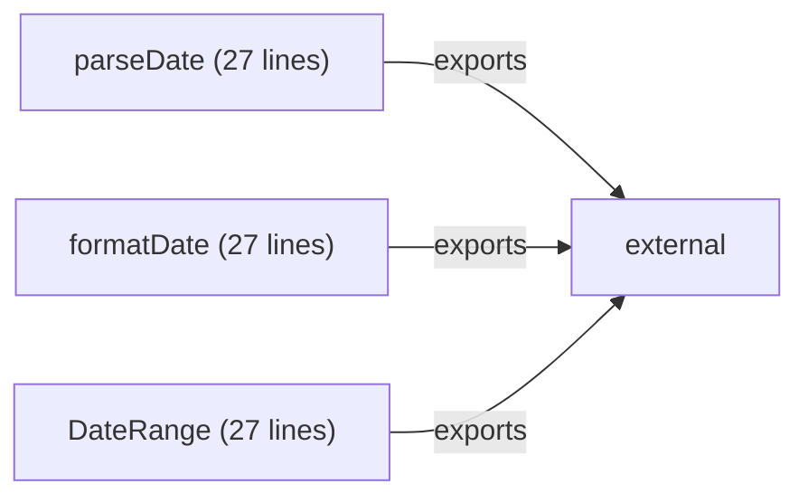

# 代码理解系统（Code Understanding System）

## 📖 概述

**代码理解系统** 是您学习框架的核心基础设施。它能够自动分析任何 JavaScript 代码（源代码或混淆代码），输出：

- ✅ **架构分析** - 识别代码的设计模式和组织方式
- ✅ **模块图** - 可视化模块边界和依赖关系  
- ✅ **数据流** - 追踪数据如何在系统间流动
- ✅ **API 识别** - 提取导出的公共接口
- ✅ **可视化报告** - 生成 Markdown、Mermaid、DOT 等格式

---

## 🎯 核心能力

### 1. 架构检测（Architecture Detection）

自动识别代码的架构模式：

```
Monolithic     → 单文件单体
Modular        → 模块化（ES6/CommonJS）
MVC            → MVC 架构
MVVM           → MVVM 架构（Vue 等）
Plugin         → 插件架构
Library        → 库/工具集
Hybrid         → 混合架构
```

**检测方式：**
- 检查模块导入导出（import/export/require）
- 识别类和原型（class/prototype）
- 分析函数式编程特征（arrow functions/map/reduce）
- 检测异步模式（async/await/Promise）
- 识别事件驱动（on/off/emit）
- 识别状态管理（setState/dispatch）

### 2. 模块分析（Module Analyzer）

从代码中自动提取：

```
ModuleInfo {
  name: "UserService",           // 模块名称
  responsibility: "用户数据处理",   // 职责描述
  exports: ["getUserById", ...],  // 导出的接口
  dependencies: ["./database"],   // 依赖的模块
  functions: ["query", ...],      // 内部函数
  variables: ["db", ...],         // 内部变量
  size: 250                        // 代码行数
}
```

### 3. 数据流追踪（Dataflow Tracking）

分析数据如何在系统间流动：

```
FunctionCall       → 函数调用链
DataPassing        → 模块间数据传递
EventPropagation   → 事件流
StateManagement    → 状态管理流
DependencyInjection → 依赖注入
```

### 4. API 识别（API Extractor）

自动识别和文档化公共接口：

```
ApiInfo {
  name: "getUserById",
  signature: "getUserById(id: number)",
  description: "获取用户信息",
  params: [
    { name: "id", type: "number", description: "用户ID" }
  ],
  return_type: "Promise<User>",
  examples: ["const user = await getUserById(123);"]
}
```

### 5. 可视化生成（Visualization）

支持多种可视化格式：

- **Mermaid** - 在 GitHub/Markdown 中直接渲染
- **Graphviz (DOT)** - 高级图表生成
- **JSON** - 用于后续处理
- **Markdown** - 结构化文本报告

---

## 🚀 快速开始

### 基础用法

```rust
use browerai_learning::CodeUnderstandingSystem;

let system = CodeUnderstandingSystem::new();

// 分析代码
let report = system.analyze(code, "MyProject")?;

// 生成文本报告
let report_text = system.generate_report(&report);
println!("{}", report_text);

// 生成可视化
let mermaid = system.visualize(&report, VisualizationFormat::Mermaid)?;
println!("{}", mermaid);
```

### 运行演示

```bash
# 运行完整演示（包含3个示例）
cargo run --example code_understanding_demo

# 输出包括：
# - 简单库代码分析
# - 模块化代码分析  
# - 混淆代码分析
```

---

## 📊 输出示例

### 示例 1：DateLib 库

**输入代码：**
```javascript
export function parseDate(dateStr) { return new Date(dateStr); }
export function formatDate(date, format) { return date.toLocaleDateString(); }
export class DateRange { ... }
```

**输出架构分析：**
```
✅ 架构检测结果:
   模式: Modular
   特征: ES6 Modules, Class-based

✅ 模块结构:
   📦 parseDate      → 日期解析功能
   📦 formatDate     → 日期格式化
   📦 DateRange      → 日期范围管理

✅ 公共 API:
   - parseDate(dateStr)
   - formatDate(date, format)
   - DateRange class
```

**可视化图表（Mermaid）：**


---

## 🔍 分析工作流

```
输入 JavaScript 代码
    ↓
[1. 架构检测]
    ├─ 检查模块系统（ES6/CommonJS/AMD）
    ├─ 识别设计模式（MVC/MVVM/Plugin）
    └─ 提取架构特征（异步/事件驱动等）
    ↓
[2. 模块分析]
    ├─ 提取导出接口（exports）
    ├─ 识别依赖关系（imports）
    ├─ 推断模块职责
    └─ 统计代码规模
    ↓
[3. 数据流追踪]
    ├─ 分析函数调用链
    ├─ 跟踪数据传递
    ├─ 识别事件流
    └─ 检测状态管理
    ↓
[4. API 识别]
    ├─ 提取函数签名
    ├─ 推断参数类型
    ├─ 生成 API 文档
    └─ 提示使用示例
    ↓
输出完整理解报告 + 可视化图表
```

---

## 💡 使用场景

### 1. 学习开源项目
```rust
// 下载 Vue/React 源代码，使用系统分析其架构
let code = std::fs::read_to_string("vue.js")?;
let report = system.analyze(&code, "Vue.js")?;

// 生成学习文档
println!("{}", system.generate_report(&report));
```

### 2. 代码重构评估
```rust
// 分析混淆代码，评估重构难度
let code = obfuscated_javascript;
let report = system.analyze(&code, "ObfuscatedLib")?;

// 查看模块数量、复杂度、API 数量
println!("模块数: {}", report.modules.len());
println!("API 数: {}", report.apis.len());
println!("复杂度: {}", report.statistics.complexity_level);
```

### 3. 架构文档生成
```rust
// 自动生成项目架构文档
let report = system.analyze(code, "MyProject")?;
let doc = system.generate_report(&report);
let viz = system.visualize(&report, VisualizationFormat::Mermaid)?;

std::fs::write("ARCHITECTURE.md", &doc)?;
```

### 4. 代码质量评估
```rust
// 评估代码的模块化程度、复杂度等
let report = system.analyze(code, "Project")?;

if report.modules.len() < 5 {
    println!("⚠️  代码没有良好的模块化");
}

if report.statistics.complexity_level == "Very High" {
    println!("⚠️  代码复杂度过高，需要重构");
}
```

---

## 🏗️ 系统架构

```
CodeUnderstandingSystem
├── ArchitectureDetector        [架构检测]
│   ├── detect_pattern()       识别架构模式
│   ├── extract_characteristics() 提取特征
│   └── describe_pattern()      生成描述
├── ModuleAnalyzer             [模块分析]
│   ├── extract_modules()      提取模块
│   ├── extract_exports()      获取导出
│   ├── extract_dependencies() 获取依赖
│   └── infer_responsibility()推断职责
├── DataflowTracker            [数据流分析]
│   ├── analyze_function_calls() 函数调用链
│   ├── analyze_event_flows()   事件流
│   ├── analyze_state_flows()   状态流
│   └── analyze_data_passing()  数据传递
├── ApiExtractor               [API 识别]
│   ├── extract()              提取 API
│   ├── parse_params()         解析参数
│   └── infer_description()    推断描述
└── GraphVisualization         [可视化]
    ├── render_dot()           生成 DOT
    ├── render_mermaid()       生成 Mermaid
    └── render_json()          生成 JSON
```

---

## 📈 输出统计

每个分析报告包含：

```
ReportStatistics {
  line_count: 1200,           // 代码行数
  function_count: 45,         // 函数数量
  variable_count: 120,        // 变量数量
  class_count: 8,             // 类数量
  module_count: 12,           // 模块数量
  complexity_level: "High"    // 复杂度等级
}
```

---

## 🎓 学习框架的核心价值

这个系统让您能够：

1. **理解架构** - 快速把握任何 JS 代码的设计结构
2. **识别模式** - 学习开源项目如何组织代码
3. **追踪数据流** - 理解数据如何在系统间流动
4. **提取知识** - 自动文档化 API 和架构
5. **评估质量** - 量化代码的复杂度和模块化程度
6. **对比分析** - 比较不同项目的架构设计

---

## 🔮 未来扩展

- [ ] 设计模式自动识别（工厂、单例、观察者等）
- [ ] 性能瓶颈分析
- [ ] 安全漏洞检测
- [ ] 类型推断和 TypeScript 转换
- [ ] 与 AI 模型集成，自动生成学习建议
- [ ] Web UI 用于交互式代码探索

---

## 📝 示例代码

完整示例见：[`examples/code_understanding_demo.rs`](../../examples/code_understanding_demo.rs)

运行：
```bash
cargo run --example code_understanding_demo
```

---

**让我们用代码理解系统学习和掌握开源框架的架构！** 🚀
