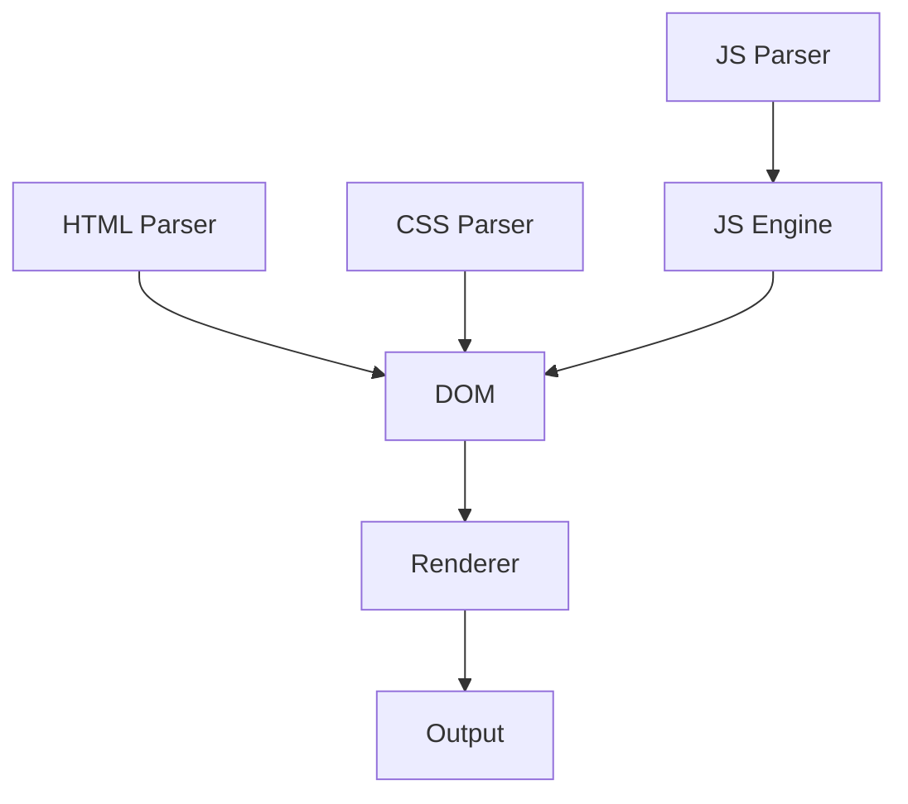

# BrowerAI Project Analysis & Improvement Recommendations

**Date**: January 7, 2026  
**Analysis Type**: Comprehensive Project Audit  
**Methodology**: Comparison with leading open-source Rust projects

---

## Executive Summary

BrowerAI is a well-structured AI-powered browser project with 19 workspace crates, 109 Rust files, and 423+ passing tests. However, there are significant opportunities for improvement in CI/CD, testing coverage, benchmarking, documentation, and developer experience.

**Overall Grade**: B+ (Good foundation, needs production hardening)

---

## 1. Project Structure Analysis

### ✅ Strengths
- **Modular Architecture**: 19 crates with clear separation of concerns
- **Modern Workspace**: Cargo workspace with shared dependencies
- **Feature Flags**: Optional dependencies (ai, ml, v8)
- **Documentation**: Good README, CONTRIBUTING, SECURITY files
- **V8 Integration**: Advanced JavaScript engine support

### ⚠️ Gaps Identified

#### 1.1 Missing CI/CD Components
**Comparison**: Tokio, Serde, Actix-web all have comprehensive CI

**Missing**:
- ❌ No automated security audit (cargo-audit)
- ❌ No dependency update automation (Dependabot)
- ❌ No code coverage reporting (Codecov/Coveralls)
- ❌ No nightly Rust testing
- ❌ No release automation
- ❌ No Docker containerization
- ❌ No performance regression detection

**Recommendation**: Add comprehensive CI/CD pipeline

#### 1.2 Testing Infrastructure
**Comparison**: Rust-analyzer has 90%+ coverage, comprehensive integration tests

**Current State**:
- ✅ 423+ unit tests passing
- ⚠️ Limited integration tests
- ❌ No property-based testing (proptest/quickcheck)
- ❌ No fuzzing tests
- ❌ No performance benchmarks in CI
- ❌ No mutation testing
- ❌ No load testing

**Recommendation**: Enhance test coverage and methodology

#### 1.3 Documentation Quality
**Comparison**: mdBook used by Rust, async-book, Tokio tutorial

**Current State**:
- ✅ Good README and API docs
- ⚠️ Missing comprehensive user guide
- ❌ No API reference (docs.rs not optimized)
- ❌ No tutorial/book format documentation
- ❌ No architecture diagrams
- ❌ No video tutorials or demos

**Recommendation**: Create comprehensive documentation suite

---

## 2. Comparison with Leading Projects

### 2.1 Tokio (Async Runtime)

**What Tokio Does Well**:
1. **Comprehensive CI**: Tests on Linux, macOS, Windows, multiple Rust versions
2. **Benchmarking**: Criterion.rs benchmarks tracked over time
3. **Documentation**: mdBook with extensive tutorials
4. **Community**: Clear contribution guidelines, Discord/Zulip
5. **Release Process**: Automated with cargo-release

**Apply to BrowerAI**:
- Add multi-platform CI testing
- Implement continuous benchmarking
- Create tutorial documentation

### 2.2 Serde (Serialization)

**What Serde Does Well**:
1. **Feature Matrix**: Clear documentation of feature combinations
2. **Derive Macros**: Ergonomic API through proc macros
3. **Format Support**: Multiple serialization formats
4. **Performance**: Zero-cost abstractions
5. **Testing**: Exhaustive test suite with proptest

**Apply to BrowerAI**:
- Add derive macros for common patterns
- Comprehensive feature testing
- Property-based testing for parsers

### 2.3 Rust-Analyzer (LSP Server)

**What Rust-Analyzer Does Well**:
1. **Architecture**: Clear module boundaries with well-defined interfaces
2. **Testing**: 90%+ code coverage, extensive integration tests
3. **Metrics**: Performance metrics tracked in CI
4. **Debugging**: Comprehensive logging and tracing
5. **Extensibility**: Plugin system with clear APIs

**Apply to BrowerAI**:
- Improve module interfaces
- Add tracing/logging infrastructure
- Enhance plugin system

---

## 3. Detailed Recommendations

### Priority 1: CI/CD Enhancement (Critical)

#### 3.1 Add Comprehensive CI Workflow

```yaml
# .github/workflows/ci.yml
name: CI

on: [push, pull_request]

jobs:
  test:
    strategy:
      matrix:
        os: [ubuntu-latest, macos-latest, windows-latest]
        rust: [stable, beta, nightly]
    runs-on: ${{ matrix.os }}
    steps:
      - uses: actions/checkout@v3
      - uses: dtolnay/rust-toolchain@master
        with:
          toolchain: ${{ matrix.rust }}
      - uses: Swatinem/rust-cache@v2
      - run: cargo test --all-features
      
  coverage:
    runs-on: ubuntu-latest
    steps:
      - uses: actions/checkout@v3
      - uses: dtolnay/rust-toolchain@stable
      - uses: taiki-e/install-action@cargo-llvm-cov
      - run: cargo llvm-cov --all-features --codecov --output-path codecov.json
      - uses: codecov/codecov-action@v3
        
  security:
    runs-on: ubuntu-latest
    steps:
      - uses: actions/checkout@v3
      - uses: actions-rs/audit-check@v1
        with:
          token: ${{ secrets.GITHUB_TOKEN }}
```

#### 3.2 Add Dependabot

```yaml
# .github/dependabot.yml
version: 2
updates:
  - package-ecosystem: "cargo"
    directory: "/"
    schedule:
      interval: "weekly"
    open-pull-requests-limit: 10
```

#### 3.3 Add Release Automation

```yaml
# .github/workflows/release.yml
name: Release

on:
  push:
    tags:
      - 'v*'

jobs:
  publish:
    runs-on: ubuntu-latest
    steps:
      - uses: actions/checkout@v3
      - run: cargo publish --token ${{ secrets.CARGO_TOKEN }}
```

### Priority 2: Testing Enhancement (High)

#### 3.4 Add Property-Based Testing

```toml
# Cargo.toml
[dev-dependencies]
proptest = "1.0"
quickcheck = "1.0"
```

```rust
// Example: crates/browerai-html-parser/src/lib.rs
#[cfg(test)]
mod proptests {
    use super::*;
    use proptest::prelude::*;
    
    proptest! {
        #[test]
        fn parse_doesnt_crash(html in ".*") {
            let parser = HtmlParser::new();
            let _ = parser.parse(&html);
        }
        
        #[test]
        fn parse_is_deterministic(html in ".*") {
            let parser = HtmlParser::new();
            let result1 = parser.parse(&html);
            let result2 = parser.parse(&html);
            prop_assert_eq!(result1.is_ok(), result2.is_ok());
        }
    }
}
```

#### 3.5 Add Fuzzing Tests

```bash
# Install cargo-fuzz
cargo install cargo-fuzz

# Add fuzz targets
cargo fuzz add html_parser
cargo fuzz add css_parser
cargo fuzz add js_parser
```

#### 3.6 Add Performance Benchmarks

```toml
# crates/browerai-html-parser/Cargo.toml
[[bench]]
name = "parser_benchmarks"
harness = false

[dev-dependencies]
criterion = { version = "0.5", features = ["html_reports"] }
```

```rust
// benches/parser_benchmarks.rs
use criterion::{black_box, criterion_group, criterion_main, Criterion};
use browerai_html_parser::HtmlParser;

fn benchmark_html_parsing(c: &mut Criterion) {
    let html = include_str!("../test_data/large.html");
    let parser = HtmlParser::new();
    
    c.bench_function("parse large html", |b| {
        b.iter(|| parser.parse(black_box(html)))
    });
}

criterion_group!(benches, benchmark_html_parsing);
criterion_main!(benches);
```

### Priority 3: Documentation Enhancement (High)

#### 3.7 Add mdBook Documentation

```bash
# Install mdbook
cargo install mdbook mdbook-toc mdbook-mermaid

# Create book structure
mdbook init docs/book
```

```toml
# docs/book/book.toml
[book]
title = "BrowerAI Guide"
authors = ["BrowerAI Contributors"]
language = "en"

[output.html]
git-repository-url = "https://github.com/vistone/BrowerAI"
```

#### 3.8 Add Architecture Diagrams

```markdown
# docs/book/src/architecture.md

## System Architecture



### Priority 4: Developer Experience (Medium)

#### 3.9 Add Pre-commit Hooks

```bash
# Install pre-commit
pip install pre-commit

# .pre-commit-config.yaml
repos:
  - repo: local
    hooks:
      - id: cargo-fmt
        name: cargo fmt
        entry: cargo fmt
        language: system
        types: [rust]
      - id: cargo-clippy
        name: cargo clippy
        entry: cargo clippy -- -D warnings
        language: system
        types: [rust]
        pass_filenames: false
```

#### 3.10 Add Just/Make Commands

```makefile
# Justfile
# Install: cargo install just

# Run all tests
test:
    cargo test --all-features --workspace

# Run with coverage
test-coverage:
    cargo llvm-cov --all-features --codecov

# Run benchmarks
bench:
    cargo bench --all-features

# Check everything
check-all: fmt clippy test
    cargo build --all-features

# Format code
fmt:
    cargo fmt --all

# Run clippy
clippy:
    cargo clippy --all-features -- -D warnings

# Build docs
docs:
    cargo doc --all-features --no-deps --open

# Clean everything
clean:
    cargo clean
    rm -rf target/
```

### Priority 5: Observability & Monitoring (Medium)

#### 3.11 Add Structured Logging

```toml
[dependencies]
tracing = "0.1"
tracing-subscriber = { version = "0.3", features = ["env-filter"] }
tracing-appender = "0.2"
```

```rust
// Example usage
use tracing::{info, debug, warn, error, instrument};

#[instrument]
pub fn parse_html(html: &str) -> Result<Dom> {
    info!("Starting HTML parsing");
    debug!(html_length = html.len(), "Input size");
    
    let result = parse_internal(html);
    
    match &result {
        Ok(dom) => info!(nodes = dom.node_count(), "Parsing successful"),
        Err(e) => error!(error = %e, "Parsing failed"),
    }
    
    result
}
```

#### 3.12 Add Metrics Collection

```toml
[dependencies]
metrics = "0.21"
metrics-exporter-prometheus = "0.13"
```

```rust
use metrics::{counter, histogram, gauge};

pub fn execute_js(code: &str) -> Result<String> {
    counter!("js_executions_total").increment(1);
    
    let start = Instant::now();
    let result = execute_internal(code);
    let duration = start.elapsed();
    
    histogram!("js_execution_duration_ms").record(duration.as_millis() as f64);
    
    if result.is_err() {
        counter!("js_execution_errors_total").increment(1);
    }
    
    result
}
```

---

## 4. Code Quality Improvements

### 4.1 Add Code Organization Standards

**Recommendation**: Follow Rust API Guidelines

```rust
// Good: Clear module structure
pub mod parser {
    pub mod html;
    pub mod css;
    pub mod js;
}

// Good: Re-export for ergonomics
pub use parser::html::HtmlParser;
pub use parser::css::CssParser;
pub use parser::js::JsParser;

// Good: Prelude for common imports
pub mod prelude {
    pub use crate::parser::{HtmlParser, CssParser, JsParser};
    pub use crate::dom::Dom;
    pub use crate::renderer::Renderer;
}
```

### 4.2 Add Error Handling Best Practices

```rust
// Use thiserror for library errors
use thiserror::Error;

#[derive(Error, Debug)]
pub enum BrowserError {
    #[error("Failed to parse HTML: {0}")]
    HtmlParsing(String),
    
    #[error("Failed to parse CSS: {0}")]
    CssParsing(String),
    
    #[error("JavaScript execution error: {0}")]
    JsExecution(String),
    
    #[error("IO error: {0}")]
    Io(#[from] std::io::Error),
}

pub type Result<T> = std::result::Result<T, BrowserError>;
```

### 4.3 Add Builder Patterns

```rust
// Example: RenderOptions builder
pub struct RenderOptions {
    viewport_width: u32,
    viewport_height: u32,
    enable_javascript: bool,
    timeout_ms: u64,
}

impl RenderOptions {
    pub fn builder() -> RenderOptionsBuilder {
        RenderOptionsBuilder::default()
    }
}

#[derive(Default)]
pub struct RenderOptionsBuilder {
    viewport_width: Option<u32>,
    viewport_height: Option<u32>,
    enable_javascript: bool,
    timeout_ms: u64,
}

impl RenderOptionsBuilder {
    pub fn viewport_width(mut self, width: u32) -> Self {
        self.viewport_width = Some(width);
        self
    }
    
    pub fn viewport_height(mut self, height: u32) -> Self {
        self.viewport_height = Some(height);
        self
    }
    
    pub fn enable_javascript(mut self) -> Self {
        self.enable_javascript = true;
        self
    }
    
    pub fn timeout_ms(mut self, ms: u64) -> Self {
        self.timeout_ms = ms;
        self
    }
    
    pub fn build(self) -> RenderOptions {
        RenderOptions {
            viewport_width: self.viewport_width.unwrap_or(1920),
            viewport_height: self.viewport_height.unwrap_or(1080),
            enable_javascript: self.enable_javascript,
            timeout_ms: self.timeout_ms,
        }
    }
}

// Usage
let options = RenderOptions::builder()
    .viewport_width(800)
    .viewport_height(600)
    .enable_javascript()
    .timeout_ms(5000)
    .build();
```

---

## 5. Performance Optimization

### 5.1 Add Profiling Infrastructure

```toml
[profile.release]
debug = true  # Enable symbols for profiling

[dependencies]
pprof = { version = "0.13", features = ["flamegraph"] }
```

### 5.2 Add Benchmarking CI

```yaml
# .github/workflows/benchmark.yml
name: Benchmark

on:
  push:
    branches: [main]
  pull_request:

jobs:
  benchmark:
    runs-on: ubuntu-latest
    steps:
      - uses: actions/checkout@v3
      - uses: dtolnay/rust-toolchain@stable
      - run: cargo bench --all-features
      - uses: benchmark-action/github-action-benchmark@v1
        with:
          tool: 'cargo'
          output-file-path: target/criterion/report/index.html
          github-token: ${{ secrets.GITHUB_TOKEN }}
          auto-push: true
```

---

## 6. Security Enhancements

### 6.1 Add Security Audit Automation

```yaml
# .github/workflows/security.yml
name: Security Audit

on:
  schedule:
    - cron: '0 0 * * *'  # Daily
  push:
    branches: [main]

jobs:
  audit:
    runs-on: ubuntu-latest
    steps:
      - uses: actions/checkout@v3
      - uses: actions-rs/audit-check@v1
```

### 6.2 Add Supply Chain Security

```toml
# .cargo/config.toml
[registries]
crates-io = { index = "sparse+https://index.crates.io/" }

[net]
git-fetch-with-cli = true
```

---

## 7. Community & Contribution

### 7.1 Add Issue Templates

```yaml
# .github/ISSUE_TEMPLATE/bug_report.yml
name: Bug Report
description: File a bug report
labels: ["bug"]
body:
  - type: markdown
    attributes:
      value: |
        Thanks for taking the time to fill out this bug report!
  - type: textarea
    id: what-happened
    attributes:
      label: What happened?
      description: Also tell us, what did you expect to happen?
    validations:
      required: true
  - type: textarea
    id: steps
    attributes:
      label: Steps to reproduce
      placeholder: |
        1. 
        2. 
        3. 
    validations:
      required: true
```

### 7.2 Add Pull Request Template

```markdown
# .github/pull_request_template.md

## Description
<!--- Describe your changes in detail -->

## Motivation and Context
<!--- Why is this change required? What problem does it solve? -->
<!--- If it fixes an open issue, please link to the issue here. -->

## How Has This Been Tested?
<!--- Please describe in detail how you tested your changes. -->

## Types of changes
- [ ] Bug fix (non-breaking change which fixes an issue)
- [ ] New feature (non-breaking change which adds functionality)
- [ ] Breaking change (fix or feature that would cause existing functionality to change)

## Checklist:
- [ ] My code follows the code style of this project
- [ ] I have added tests to cover my changes
- [ ] All new and existing tests passed
- [ ] I have updated the documentation accordingly
```

---

## 8. Actionable Implementation Plan

### Week 1: Foundation
- [ ] Add comprehensive CI/CD workflows
- [ ] Set up code coverage reporting
- [ ] Add Dependabot configuration
- [ ] Implement pre-commit hooks

### Week 2: Testing
- [ ] Add property-based tests for parsers
- [ ] Implement fuzzing targets
- [ ] Create comprehensive benchmark suite
- [ ] Add integration test scenarios

### Week 3: Documentation
- [ ] Create mdBook documentation
- [ ] Add architecture diagrams
- [ ] Write comprehensive tutorials
- [ ] Generate API documentation

### Week 4: Polish
- [ ] Add structured logging/tracing
- [ ] Implement metrics collection
- [ ] Create issue/PR templates
- [ ] Write contribution guide

---

## 9. Success Metrics

### Targets (3 months)
- **Test Coverage**: 80%+
- **CI Success Rate**: 95%+
- **Documentation Coverage**: 90%+
- **Response Time**: <24h for issues
- **Performance**: No regressions
- **Security**: Zero known vulnerabilities

---

## 10. Conclusion

BrowerAI has a solid foundation but needs production-grade tooling and processes. By implementing these recommendations, the project will match or exceed the quality standards of leading Rust projects like Tokio, Serde, and Rust-Analyzer.

**Priority Order**:
1. CI/CD & Testing (Critical for reliability)
2. Documentation (Critical for adoption)
3. Performance Monitoring (Important for optimization)
4. Developer Experience (Important for contributions)
5. Community Building (Important for growth)

**Estimated Effort**: 4-6 weeks for full implementation

---

**Next Steps**: Start with Priority 1 (CI/CD) and work through the recommendations systematically.
